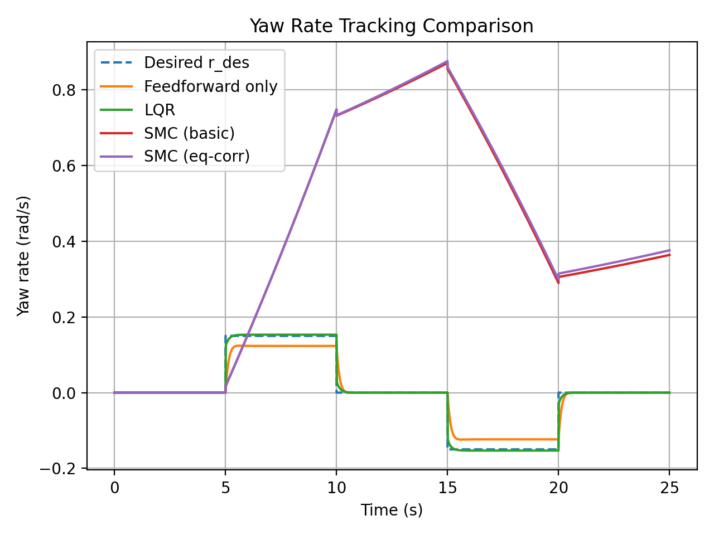
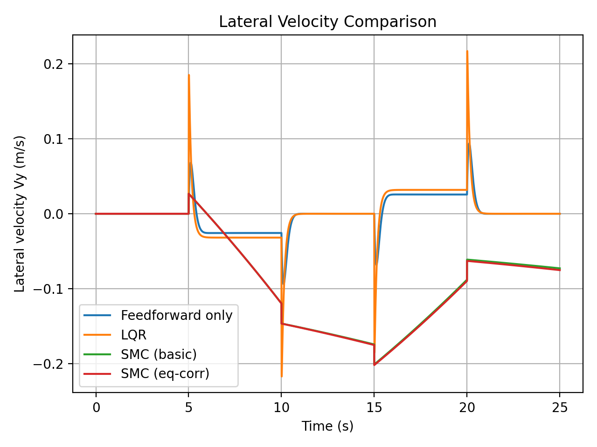

# **VehicleLateralStability-Py**

Linear Vehicle Lateral Dynamics:

**Feedforward, LQR, and Sliding Mode Control (Python Implementation)**

---

## Abstract

This project presents a Python-based study of **vehicle lateral stability control** based on a linear bicycle model.

Feedforward steering, Linear Quadratic Regulator (LQR), and Sliding Mode Control (SMC) strategies are implemented and compared under identical road curvature disturbances.

The objective is to evaluate **yaw-rate tracking performance**, **lateral velocity regulation**, **control effort**, and **robustness trade-offs** through reproducible numerical simulations. The codebase is modular and designed for extension to more advanced models and controllers.

---

## Introduction

Vehicle lateral dynamics are fundamental to **handling stability, safety, and autonomous driving systems**.  
Accurate yaw-rate tracking and lateral motion regulation help maintain path-following performance during curvature changes.

This project models lateral vehicle behavior using a **linear bicycle model** and compares three controller classes:

- **Feedforward steering** based on road curvature (Ackermann-style approximation)
- **LQR** for optimal state feedback under nominal dynamics
- **SMC** for robustness-oriented feedback

All controllers are evaluated under the same curvature profile to enable fair comparison.

---

## Mathematical Modeling

This project studies a **planar 2D pursuit-evasion interception problem** using a minimal but control-faithful point-mass model. The missile and target are both modeled as second-order particles in an inertial plane, while guidance and control are formulated in **relative coordinates** for clarity and direct interception reasoning.

The modeling stack consists of:

1. inertial-frame point-mass dynamics for missile and target,
2. a relative-state formulation for guidance,
3. discrete-time propagation for simulation and control,
4. a geometric capture condition,
5. actuator limits and slew-rate constraints for physically meaningful control.

### 1) Inertial-Frame States, Inputs, and Assumptions

The model uses a 2D inertial frame with the following quantities:

- Missile position: $p_m \in \mathbb{R}^2$
- Missile velocity: $v_m \in \mathbb{R}^2$
- Target position: $p_t \in \mathbb{R}^2$
- Target velocity: $v_t \in \mathbb{R}^2$

The missile control input is its commanded planar acceleration:

$$
u \in \mathbb{R}^2
$$

The target acceleration is not controlled by the interceptor. Instead, it is defined by the scenario:

$$
a_t(t) \in \mathbb{R}^2
$$

This keeps the problem intentionally minimal and interpretable:

- both agents are **point masses**,
- motion is purely **2D planar**,
- no aerodynamics, attitude, seeker, or propulsion dynamics are modeled,
- target acceleration is assumed available from the scenario definition.

### 2) Continuous-Time Point-Mass Dynamics

The missile and target follow second-order kinematics.

#### Missile dynamics

$$
\dot{p}_m = v_m
$$

$$
\dot{v}_m = u
$$

#### Target dynamics

$$
\dot{p}_t = v_t
$$

$$
\dot{v}_t = a_t(t)
$$

These equations say exactly what the simulator implements:

- position is the integral of velocity,
- velocity is the integral of acceleration,
- the missile acceleration is the control input,
- the target acceleration is externally specified by the chosen scenario.

This is the cleanest control-oriented model for studying interception geometry without burying the problem under unnecessary vehicle-specific detail.

### 3) Relative-State Formulation

For guidance and interception, the problem is written in **relative coordinates**.

The relative position and relative velocity are defined as:

$$
r = p_t - p_m
$$

$$
v_{\text{rel}} = v_t - v_m
$$

The relative state vector is:

$$
x =
\begin{bmatrix}
r_x \\
r_y \\
v_x \\
v_y
\end{bmatrix}
=
\begin{bmatrix}
p_{t,x} - p_{m,x} \\
p_{t,y} - p_{m,y} \\
v_{t,x} - v_{m,x} \\
v_{t,y} - v_{m,y}
\end{bmatrix}
$$

This is the state used throughout the notebook’s guidance logic and diagnostics. It exposes the interception geometry directly: if the relative position goes to zero, the missile reaches the target.

### 4) Continuous-Time Relative Dynamics

Starting from the inertial dynamics,

$$
r = p_t - p_m
\quad \Rightarrow \quad
\dot{r} = \dot{p}_t - \dot{p}_m = v_t - v_m = v_{\text{rel}}
$$

and similarly,

$$
\dot{v}_{\text{rel}} = \dot{v}_t - \dot{v}_m = a_t(t) - u
$$

Therefore, the relative dynamics are:

$$
\dot{r} = v_{\text{rel}}
$$

$$
\dot{v}_{\text{rel}} = a_t(t) - u
$$

or, component-wise,

$$
\dot{r}_x = v_x, \qquad \dot{r}_y = v_y
$$

$$
\dot{v}_x = a_{t,x}(t) - u_x, \qquad
\dot{v}_y = a_{t,y}(t) - u_y
$$

This is the central modeling equation of the project. It makes the controller’s job precise:

- reduce relative position,
- reduce relative velocity mismatch,
- do so under acceleration and slew-rate limits.

### 5) Continuous-Time State-Space Form

Using the relative state

$$
x =
\begin{bmatrix}
r_x \\
r_y \\
v_x \\
v_y
\end{bmatrix},
\qquad
u =
\begin{bmatrix}
u_x \\
u_y
\end{bmatrix},
\qquad
a_t =
\begin{bmatrix}
a_{t,x} \\
a_{t,y}
\end{bmatrix},
$$

the dynamics can be written in linear state-space form as

$$
\dot{x} = A_c x + B_c u + E_c a_t
$$

with

$$
A_c =
\begin{bmatrix}
0 & 0 & 1 & 0 \\
0 & 0 & 0 & 1 \\
0 & 0 & 0 & 0 \\
0 & 0 & 0 & 0
\end{bmatrix}
$$

$$
B_c =
\begin{bmatrix}
0 & 0 \\
0 & 0 \\
-1 & 0 \\
0 & -1
\end{bmatrix}
$$

$$
E_c =
\begin{bmatrix}
0 & 0 \\
0 & 0 \\
1 & 0 \\
0 & 1
\end{bmatrix}
$$

Interpretation:

- **$A_c$** propagates the kinematic relationship between relative position and relative velocity,
- **$B_c$** shows that missile acceleration drives the relative acceleration with a negative sign,
- **$E_c$** injects target acceleration as an external disturbance / known scenario term.

This linear structure is exactly why constrained MPC can be posed cleanly as a quadratic program.

### 6) Discrete-Time Formulation

The project uses discrete-time simulation with timestep

$$
dt = 0.05 \text{ s}
$$

and the controller works over repeated simulation steps up to

$$
t_{\max} = 25.0 \text{ s}
$$

The notebook writes the control model generically as

$$
x_{k+1} = A x_k + B u_k + d_k
$$

where:

- $x_k$ is the relative state at step $k$,
- $u_k$ is the missile acceleration command,
- $d_k$ captures the target-acceleration contribution over the step.

At the modeling level, the disturbance term comes from target maneuvering:

$$
d_k \sim a_t(k\,dt)
$$

The notebook discusses Euler discretization as the simple discrete-time interpretation for controller reasoning, while the actual state propagation in simulation is implemented through numerical integration of the point-mass dynamics. In the finalized simulator, the propagation wrappers use **RK4 by default** for cleaner and more stable stepping of both missile and target trajectories.

### 7) Numerical Integration Used in Simulation

For either missile or target, the simulator packages the state as

$$
s =
\begin{bmatrix}
p_x \\
p_y \\
v_x \\
v_y
\end{bmatrix}
$$

with continuous dynamics

$$
\dot{s} =
\begin{bmatrix}
v_x \\
v_y \\
a_x \\
a_y
\end{bmatrix}
$$

The notebook implements both:

- Forward Euler
- RK4

but the default simulation method is **RK4**, used through the common stepping wrapper for both agents.

That means the simulated trajectories are not just algebraic discrete jumps. They are produced by numerically integrating the continuous-time point-mass equations under piecewise-constant acceleration commands over each timestep.

### 8) Capture / Interception Condition

Interception is defined geometrically using a capture radius:

$$
\|r_k\| = \|p_t - p_m\| \le R_{\text{capture}}
$$

The project uses

$$
R_{\text{capture}} = 5.0 \text{ m}
$$

So the missile is considered to have intercepted the target when the Euclidean distance between them falls below 5 meters.

This is a **proximity-based capture model**, not a warhead or fuse model. The repository explicitly does **not** include:

- terminal blast logic,
- fuse timing,
- damage modeling,
- post-impact dynamics.

That is why the project notes that repeated threshold crossings or visually overlapping trajectories near interception are modeling artifacts of point-mass motion plus discrete-time capture checking, not controller failure.

### 9) Scenario Modeling

The missile dynamics remain fixed across experiments. What changes from scenario to scenario is the target acceleration law $a_t(t)$.

The notebook explicitly defines scenario families such as:

- **straight target**: zero target acceleration,
- **turning target**: acceleration applied perpendicular to target velocity,
- more stressed maneuvers built by increasing target aggressiveness and/or tightening missile constraints.

A turning target is generated by taking the unit direction of target velocity and rotating it by $90^\circ$ to form a perpendicular vector. If $\hat{v}$ is the target velocity direction, then the scenario acceleration has the form

$$
a_t = a_{\text{lat}} \, \hat{v}_{\perp}
$$

which creates continuous lateral maneuvering without changing the underlying point-mass model.

So the project’s difficulty comes from **scenario-defined maneuvering**, not from changing the equations of motion.

### 10) Physical Control Constraints

To keep the problem physically meaningful, the missile acceleration command is constrained.

The project uses per-axis box bounds:

$$
|u_x| \le a_{\max}, \qquad |u_y| \le a_{\max}
$$

with

$$
a_{\max} = 30.0 \text{ m/s}^2
$$

In addition, control smoothness is limited through a per-axis slew-rate bound:

$$
|u_k - u_{k-1}| \le du_{\max}
$$

applied component-wise, with

$$
du_{\max} = 10.0 \text{ m/s}^2 \text{ per step}
$$

These constraints matter a lot:

- the PD baseline can become reactive and saturate hard,
- the MPC controller explicitly plans under these limits,
- stressed scenarios reveal why foresight matters.

### 11) Baseline Guidance Model

The classical reference controller is a PD law written directly on the relative state:

$$
u_{\text{raw}} = k_p r + k_d v_{\text{rel}}
$$

where the notebook config uses:

$$
k_p = 0.8, \qquad k_d = 1.6
$$

This raw command is then passed through:

1. **slew-rate limiting**, and
2. **box acceleration saturation**

before being applied to the missile model.

So the baseline is not unconstrained textbook PD. It is a physically clipped PD guidance law operating on the same relative-state model used by the rest of the project.

### 12) MPC Prediction Model

The constrained MPC controller uses the same relative-state structure, but optimizes control over a finite horizon instead of reacting myopically.

The notebook configuration uses

$$
N_{\text{mpc}} = 25
$$

which, with $dt = 0.05$ s, corresponds to an MPC look-ahead horizon of

$$
N_{\text{mpc}} \, dt = 1.25 \text{ s}
$$

The optimization objective penalizes four things over the prediction horizon:

- relative position error,
- relative velocity error,
- control effort,
- control smoothness.

Using the project’s notation, the objective is formed from:

$$
\sum_{i=0}^{N-1} w_r \|r_i\|^2
$$

$$
\sum_{i=0}^{N-1} w_v \|v_{\text{rel},i}\|^2
$$

$$
\sum_{i=0}^{N-1} w_u \|u_i\|^2
$$

$$
\sum_{i=0}^{N-1} w_{\Delta u} \|u_i - u_{i-1}\|^2
$$

with config weights:

$$
w_r = 10.0, \qquad
w_v = 1.0, \qquad
w_u = 0.05, \qquad
w_{\Delta u} = 0.5
$$

subject to:

$$
x_{i+1} = A x_i + B u_i + d_i
$$

and the acceleration / slew constraints.

Only the first optimized control action is applied at each step, and the problem is re-solved at the next step in receding-horizon fashion.

### 13) Why This Model Works Well for the Project

This modeling choice is deliberately minimal, but it is exactly what the project needs.

It gives:

- clean interception geometry through relative coordinates,
- deterministic and interpretable dynamics,
- a linear prediction model suitable for QP-based MPC,
- an apples-to-apples comparison between a classical PD baseline and constrained optimal control.

At the same time, it stays honest about what is **not** modeled:

- no attitude dynamics,
- no seeker or sensor noise,
- no missile aerodynamics,
- no terminal blast model,
- no state estimation problem,
- no 3D engagement geometry.

That is why the repository is strong as an **engineering-first optimal-control interception study** rather than pretending to be a full missile simulation.

### 14) Modeling Summary

In compact form, the project uses:

#### Inertial dynamics
$$
\dot{p}_m = v_m, \qquad \dot{v}_m = u
$$

$$
\dot{p}_t = v_t, \qquad \dot{v}_t = a_t(t)
$$

#### Relative dynamics
$$
r = p_t - p_m, \qquad v_{\text{rel}} = v_t - v_m
$$

$$
\dot{r} = v_{\text{rel}}, \qquad \dot{v}_{\text{rel}} = a_t(t) - u
$$

#### Capture condition
$$
\|r\| \le R_{\text{capture}}
$$

#### Control constraints

$$
|u_x|, |u_y| \le a_{\max}, \qquad
|u_k - u_{k-1}| \le du_{\max}
$$

This mathematical model is the backbone of the repository’s simulation, metrics, plots, and controller comparison pipeline.
---

## Folder Structure

```text
VehicleLateralStability-Py/
  requirements.txt                    # dependencies
  README.md                           # this file/text
  VehicleLateralStability-Py.pdf      # pdf-output of the jupyter notebook implementation
  src/
    params.py
    profiles.py
    model.py
    controllers.py
    simulate.py
    metrics.py
    plotting.py
  scripts/
    run_all.py                        # main script
  results/
    01_curvature.png
    02_u_ff.png
    03_yaw_compare.png
    04_vy_compare.png
```

---

## How to Run

### 1) Create a virtual environment

```bash
python -m venv venv
```

### 2) Activate the environment

**Windows**
```bash
venv\Scripts\activate
```

**Linux / macOS**
```bash
source venv/bin/activate
```

### 3) Install dependencies

```bash
pip install -r requirements.txt
```

### 4) Run all simulations + save results

```bash
python scripts/run_all.py
```

Outputs:
- Figures saved into `results/`
- Metrics table printed to the terminal

---

## Results and Discussion

### Feedforward (baseline)
- Produces the required steering for constant curvature via $\delta_{\text{ff}} = L\rho$.
- Tracks $r_{\text{des}}$ only approximately and shows transient tracking error during curvature transitions.
- Lowest steering effort and smoothest steering profile.

### LQR (optimal under nominal dynamics)
- Achieves the best yaw-rate tracking among the tested controllers.
- Uses additional steering correction to reject transient error, increasing steering activity and control rate.
- Performance depends on how accurately the linear model matches the true vehicle.

### SMC (robust control under constraints)
- In this setup, SMC prioritizes robustness / sliding-surface convergence rather than minimizing yaw-rate tracking error directly.
- Switching action can drive high control rates; with actuator saturation, the controller may not realize the intended sliding behavior.
- The “equivalent correction” variant reduces chattering (lower control rate) but does not necessarily improve tracking accuracy, especially when reference commands are step-like and steering authority is limited.

 

**Key takeaway:** LQR excels at tracking under the nominal model, while SMC highlights robustness–performance trade-offs and sensitivity to actuator limits.

---

## Conclusion

This project delivers a complete, reproducible Python implementation of vehicle lateral dynamics and classical controllers:

- Feedforward provides a clean baseline.
- LQR offers superior tracking performance under nominal assumptions.
- SMC provides a robustness-oriented alternative, with performance strongly influenced by actuator saturation and reference shape.

This repository serves as a **baseline implementation** for vehicle lateral control studies and can be readily extended toward nonlinear tire models, gain scheduling, MPC, or preview-based reference generation.

---

**Author: Ayushman Mishra**

**LinkedIn:** https://www.linkedin.com/in/aymisxx/

**GitHub:** https://github.com/aymisxx

---
